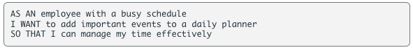

# Third-Party APIs Challenge: Work Day Scheduler

## Description
The purpose of this repository is to create a dynamic and responsive application that will display a simple calendar which allows a user to save events for each hour of the day.

This application was created using HTML, CSS, JavaScript and Moment.js libraries and other moment alternatives with the help of a provided starter code. 

## Table of Contents 
- [User Story](#user-story)
- [Acceptance Criteria](#acceptance-criteria)
- [Technologies Used](#technologies-and-libraries)
- [Final Application](#final-application)
- [Credits](#credits)
- [License](#license)

## User Story

## Acceptance Criteria

### Additional instructions:
* Moment.js library to work with date and time.
* Application deploys at live URL with no loading errors. 
* Application user experience is intuitive, easy to navigate, and the use interface style is clean and polished.
* Repository as a unique name, has proper file structure, naming conventions, proper indentation, quality comments, and a quality README file with description, screenshot of the final project, and a link to the live deployed application.
* Application resembles the following mock-up functionality: 

## Technologies and Libraries
* 
* 
* 
* 
* 
* 
* Moment.js 

## Final Application
[View Live Planner](https://alandry110.github.io/workday-scheduler/)

## Credits
To create this application, I sought help from multiple resources, which include:

* YouTube: 
    - https://www.youtube.com/watch?v=nmAHDEO9RW8 : helped me understand moment.js 

## License 
MIT License

Copyright © 2022, Ashlynn Landry

Permission is hereby granted, free of charge, to any person obtaining a copy
of this software and associated documentation files (the "Software"), to deal
in the Software without restriction, including without limitation the rights
to use, copy, modify, merge, publish, distribute, sublicense, and/or sell
copies of the Software, and to permit persons to whom the Software is
furnished to do so, subject to the following conditions:

The above copyright notice and this permission notice shall be included in all
copies or substantial portions of the Software.

THE SOFTWARE IS PROVIDED "AS IS", WITHOUT WARRANTY OF ANY KIND, EXPRESS OR
IMPLIED, INCLUDING BUT NOT LIMITED TO THE WARRANTIES OF MERCHANTABILITY,
FITNESS FOR A PARTICULAR PURPOSE AND NONINFRINGEMENT. IN NO EVENT SHALL THE
AUTHORS OR COPYRIGHT HOLDERS BE LIABLE FOR ANY CLAIM, DAMAGES OR OTHER
LIABILITY, WHETHER IN AN ACTION OF CONTRACT, TORT OR OTHERWISE, ARISING FROM,
OUT OF OR IN CONNECTION WITH THE SOFTWARE OR THE USE OR OTHER DEALINGS IN THE
SOFTWARE.

